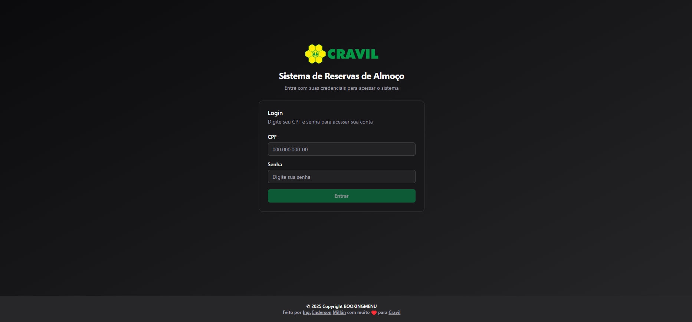
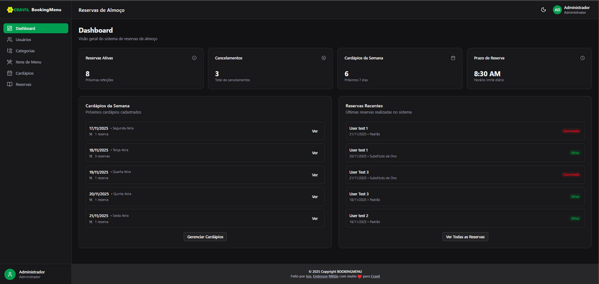
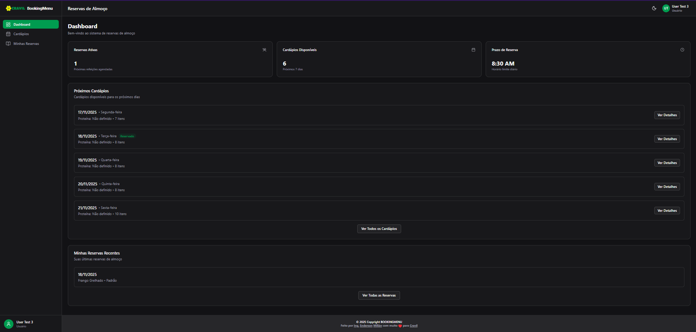
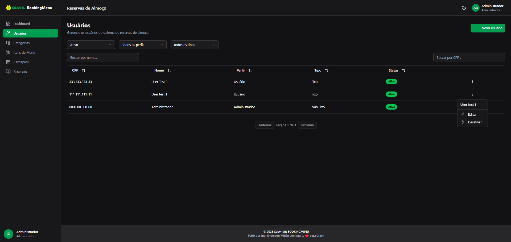
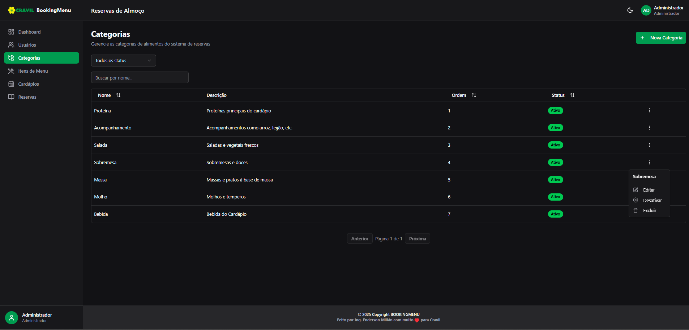
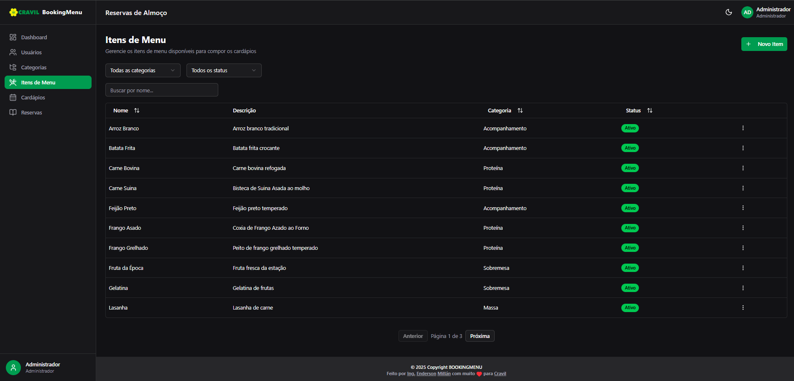
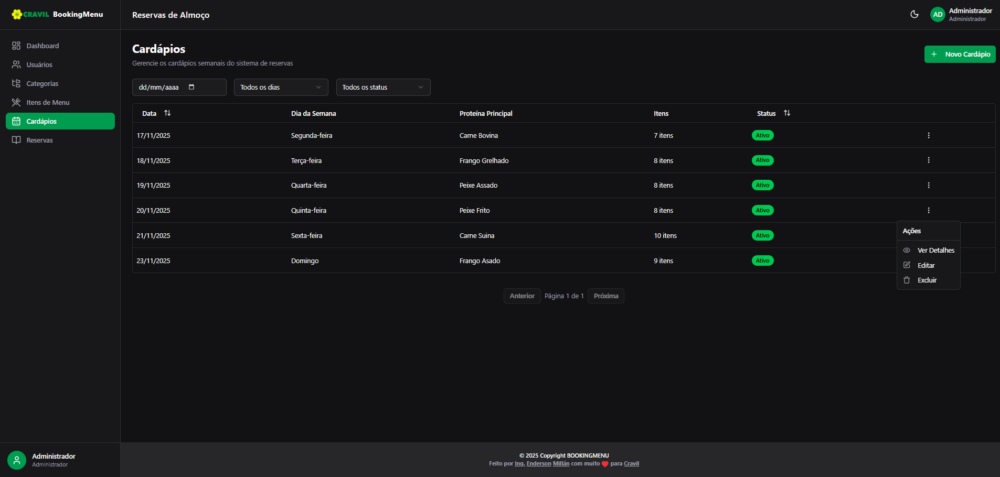
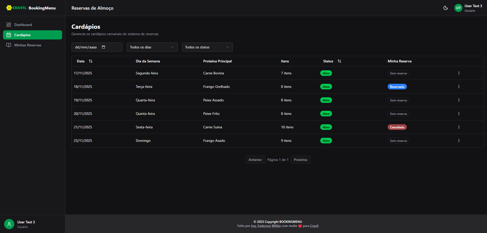
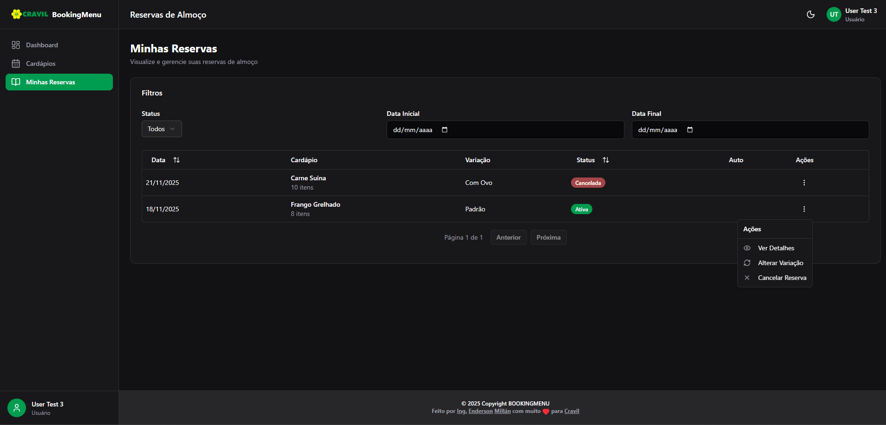

# 🍽️ Sistema de Reservas de Almoço Corporativo - Frontend

Sistema web moderno para gerenciamento de reservas de almoço corporativo, desenvolvido com Next.js 15, TypeScript, React 19 e Tailwind CSS.

## 📋 Sobre o Projeto

Este é o frontend do sistema de reservas de almoço corporativo que permite:

- **Para Usuários:**
  - Visualizar cardápios semanais
  - Fazer reservas de almoço
  - Alterar variações de reservas (padrão, com ovo)
  - Cancelar reservas (até 8:30 AM do dia da refeição)
  - Visualizar histórico de reservas

- **Para Administradores:**
  - Gerenciar usuários do sistema
  - Gerenciar categorias de alimentos
  - Gerenciar itens de menu
  - Criar e gerenciar cardápios semanais
  - Visualizar todas as reservas do sistema
  - Gerar relatórios

## 📸 Screenshots

<div style="overflow-x: auto;">
    <table style="width: 100%;">
        <tr>
            <td style="width: 50%;"></td>
            <td style="width: 50%;"></td>
        </tr>
        <tr>
            <td style="width: 50%;"></td>
            <td style="width: 50%;"></td>
        </tr>
        <tr>
            <td style="width: 50%;"></td>
            <td style="width: 50%;"></td>
        </tr>
        <tr>
            <td style="width: 50%;"></td>
            <td style="width: 50%;"></td>
        </tr>
        <tr>
            <td style="width: 50%;"></td>
        </tr>
    </table>
</div>

## 🚀 Tecnologias

- **Framework:** Next.js 15.4.1 (App Router)
- **Linguagem:** TypeScript 5.8.3
- **UI Library:** React 19.1.0
- **Estilização:** Tailwind CSS 4 + shadcn/ui
- **Formulários:** React Hook Form 7.62.0 + Zod 4.0.15
- **Estado Assíncrono:** Tanstack Query 5.83.0
- **Autenticação:** Better Auth 1.2.12 + JWT
- **Ícones:** Lucide React 0.536.0
- **Datas:** dayjs 1.11.19
- **Máscaras:** react-number-format 5.4.4
- **Notificações:** sonner 2.0.7
- **Tema:** next-themes 0.4.6

## 📁 Estrutura de Pastas

```
src/
├── app/                          # Next.js App Router
│   ├── (auth)/                   # Grupo de rotas de autenticação
│   │   └── login/                # Página de login
│   ├── (dashboard)/              # Grupo de rotas autenticadas
│   │   ├── layout.tsx            # Layout com sidebar e header
│   │   ├── page.tsx              # Dashboard home
│   │   ├── usuarios/             # Gerenciamento de usuários (admin)
│   │   ├── categorias/           # Gerenciamento de categorias (admin)
│   │   ├── itens-menu/           # Gerenciamento de itens de menu (admin)
│   │   ├── cardapios/            # Visualização e gerenciamento de cardápios
│   │   ├── minhas-reservas/      # Minhas reservas (user)
│   │   └── reservas/             # Todas as reservas (admin)
│   └── globals.css               # Estilos globais
│
├── _components/                  # Componentes compartilhados
│   ├── common/                   # Componentes comuns (header, sidebar, etc)
│   └── ui/                       # Componentes shadcn/ui
│
├── _hooks/                       # Custom hooks
│   ├── queries/                  # Hooks Tanstack Query (GET)
│   ├── mutations/                # Hooks Tanstack Query (POST/PUT/DELETE)
│   └── use-auth.ts              # Hook de autenticação
│
├── _lib/                         # Utilitários
│   ├── api-client.ts            # Cliente HTTP com JWT
│   ├── utils.ts                 # Utilitários gerais
│   └── date-utils.ts            # Utilitários de data
│
├── _schemas/                     # Schemas Zod para validação
│   ├── auth.schema.ts
│   ├── user.schema.ts
│   ├── category.schema.ts
│   ├── menu-item.schema.ts
│   ├── menu.schema.ts
│   └── reservation.schema.ts
│
├── _services/                    # Serviços de API
│   ├── auth.service.ts
│   ├── user.service.ts
│   ├── category.service.ts
│   ├── menu-item.service.ts
│   ├── menu.service.ts
│   ├── reservation.service.ts
│   └── week-day.service.ts
│
├── _types/                       # Tipos TypeScript
│   ├── auth.ts
│   ├── user.ts
│   ├── category.ts
│   ├── menu-item.ts
│   ├── menu.ts
│   ├── reservation.ts
│   └── week-day.ts
│
└── _providers/                   # Context providers
    ├── react-query.tsx
    └── auth-provider.tsx
```

## ⚙️ Variáveis de Ambiente

Crie um arquivo `.env` na raiz do projeto com as seguintes variáveis:

```env
# URL da API Backend
NEXT_PUBLIC_API_URL=http://localhost:8080/api
```

### Descrição das Variáveis

- `NEXT_PUBLIC_API_URL`: URL base da API REST do backend. O prefixo `NEXT_PUBLIC_` torna a variável acessível no lado do cliente.

## 🛠️ Instalação e Configuração

### Pré-requisitos

- Node.js 20.x ou superior
- npm, yarn, pnpm ou bun
- Backend da API rodando (veja README_API.MD)

### Instalação

1. Clone o repositório:

```bash
git clone <repository-url>
cd booking-menu-front
```

2. Instale as dependências:

```bash
npm install
# ou
yarn install
# ou
pnpm install
```

3. Configure as variáveis de ambiente:

```bash
cp .env.example .env
# Edite o arquivo .env com suas configurações
```

4. Inicie o servidor de desenvolvimento:

```bash
npm run dev
# ou
yarn dev
# ou
pnpm dev
```

5. Acesse a aplicação em [http://localhost:3000](http://localhost:3000)

## 📝 Scripts Disponíveis

```bash
# Desenvolvimento
npm run dev          # Inicia o servidor de desenvolvimento

# Build
npm run build        # Cria build de produção
npm run start        # Inicia servidor de produção

# Qualidade de Código
npm run lint         # Executa ESLint
npm run test         # Executa testes com Vitest
npm run test:a11y    # Executa testes de acessibilidade

# Git Hooks
npm run prepare      # Configura Husky para git hooks
```

## 🧪 Testes

O projeto utiliza Vitest para testes unitários e de integração.

```bash
# Executar todos os testes
npm run test

# Executar testes em modo watch
npm run test -- --watch

# Executar testes com coverage
npm run test -- --coverage
```

## 🎨 Padrões de Código

### Convenções de Nomenclatura

- **Arquivos e pastas:** kebab-case (`user-form.tsx`, `use-get-users.ts`)
- **Componentes React:** PascalCase (`UserForm`, `MenuCard`)
- **Funções e variáveis:** camelCase (`getUserById`, `isLoading`)
- **Constantes:** UPPER_SNAKE_CASE (`API_BASE_URL`)

### Estrutura de Componentes

```typescript
// Componentes de página específica vão em _components
src / app / dashboard / usuarios / _components / user - form.tsx;

// Componentes reutilizáveis vão em _components/common
src / _components / common / header.tsx;

// Componentes UI (shadcn) vão em _components/ui
src / _components / ui / button.tsx;
```

### Formulários

Sempre use React Hook Form + Zod para validação:

```typescript
import { useForm } from "react-hook-form";
import { zodResolver } from "@hookform/resolvers/zod";
import { z } from "zod";

const schema = z.object({
  name: z.string().min(3),
});

const form = useForm({
  resolver: zodResolver(schema),
});
```

### Requisições à API

Use Tanstack Query para todas as requisições:

```typescript
// Query (GET)
const { data, isLoading } = useGetUsers();

// Mutation (POST/PUT/DELETE)
const { mutate } = useCreateUser();
```

## 🔐 Autenticação

O sistema utiliza JWT (JSON Web Tokens) para autenticação:

1. Usuário faz login com CPF e senha
2. Backend retorna token JWT
3. Token é armazenado no localStorage
4. Token é enviado em todas as requisições via header `Authorization: Bearer <token>`
5. Token expira após período configurado no backend

### Controle de Acesso

- **USER:** Acesso a cardápios e suas próprias reservas
- **ADMIN:** Acesso completo ao sistema (usuários, categorias, itens, cardápios, todas as reservas)

## 📱 Responsividade

O sistema é totalmente responsivo e funciona em:

- **Mobile:** 320px+
- **Tablet:** 768px+
- **Desktop:** 1024px+

## 🎨 Temas

O sistema suporta dark mode usando next-themes. O usuário pode alternar entre tema claro e escuro através do toggle no header.

## 🚀 Deploy

### Build de Produção

```bash
npm run build
npm run start
```

### Deploy na Vercel

O projeto está otimizado para deploy na Vercel:

1. Conecte seu repositório na Vercel
2. Configure a variável de ambiente `NEXT_PUBLIC_API_URL`
3. Deploy automático a cada push

### Deploy em Outros Servidores

O projeto pode ser deployado em qualquer servidor que suporte Node.js:

```bash
npm run build
npm run start
```

## ♿ Acessibilidade

O sistema foi desenvolvido seguindo as diretrizes **WCAG 2.1 nível AA** para garantir acessibilidade a todos os usuários.

### Recursos de Acessibilidade

- ✅ **Navegação por teclado** completa
- ✅ **Skip links** para conteúdo principal
- ✅ **ARIA labels** em todos os componentes interativos
- ✅ **Focus indicators** visíveis e com alto contraste
- ✅ **Contraste de cores** WCAG AA em todos os temas
- ✅ **Suporte a screen readers** (NVDA, JAWS, VoiceOver)
- ✅ **Touch targets** mínimos de 44x44px
- ✅ **Suporte a prefers-reduced-motion**
- ✅ **Formulários** totalmente acessíveis
- ✅ **Tabelas** com estrutura semântica apropriada

### Testes de Acessibilidade

Execute os testes automatizados:

```bash
npm run test:a11y
```

Para mais informações sobre acessibilidade e testes manuais, consulte:

- [ACCESSIBILITY.md](./docs/ACCESSIBILITY.md) - Guia completo de acessibilidade
- [ACCESSIBILITY_TESTING.md](./docs/ACCESSIBILITY_TESTING.md) - Guia de testes

## 📚 Documentação Adicional

- [ACCESSIBILITY.md](./docs/ACCESSIBILITY.md) - Guia completo de acessibilidade
- [ACCESSIBILITY_TESTING.md](./docs/ACCESSIBILITY_TESTING.md) - Guia de testes de acessibilidade
- [CONTRIBUTING.md](./docs/CONTRIBUTING.md) - Guia de contribuição para o projeto
- [DEVELOPMENT.md](./docs/DEVELOPMENT.md) - Guia detalhado de desenvolvimento
- [CHANGELOG.md](./docs/CHANGELOG.md) - Histórico de mudanças do projeto
- [PERFORMANCE.md](./docs/PERFORMANCE.md) - Guia de otimização de performance
- [ERROR-HANDLING.md](./docs/ERROR-HANDLING.md) - Guia de tratamento de erros
- [Next.js Documentation](https://nextjs.org/docs)
- [shadcn/ui Components](https://ui.shadcn.com/)
- [Tanstack Query](https://tanstack.com/query/latest)

## 🤝 Contribuindo

1. Crie uma branch para sua feature (`git checkout -b feat/nova-feature`)
2. Commit suas mudanças seguindo Conventional Commits (`git commit -m 'feat: adiciona nova feature'`)
3. Push para a branch (`git push origin feat/nova-feature`)
4. Abra um Pull Request

### Conventional Commits

O projeto utiliza Conventional Commits com Commitlint:

- `feat:` nova funcionalidade
- `fix:` correção de bug
- `refactor:` refatoração de código
- `style:` mudanças de estilo/formatação
- `docs:` documentação
- `test:` testes
- `chore:` tarefas de manutenção

## 📄 Licença

Este projeto é privado e proprietário.

## 👥 Equipe

Desenvolvido pela equipe de desenvolvimento.

## 📞 Suporte

Para suporte, entre em contato através dos canais oficiais da empresa.
